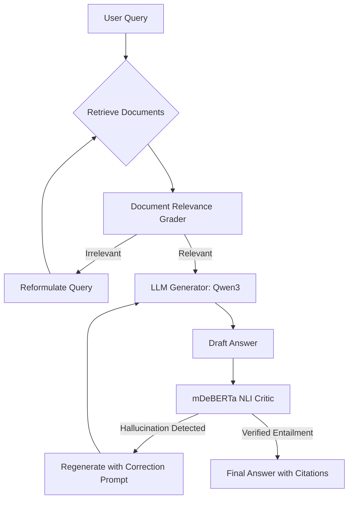

# Agentic RAG with Self-Correction and Citation Highlighting

A robust, enterprise-grade Retrieval-Augmented Generation (RAG) system built with LangGraph, ChromaDB, and local Qwen3 via Ollama. This project features a state-of-the-art agentic pipeline with sentence-level hallucination detection, dynamic self-correction, query reformulation, and source citation highlighting.

Developed as a B.Tech AI 4th-Semester Project by **Darshan Karna**.

---

## 🌟 Key Features

- **Agentic LangGraph Pipeline**: An advanced state machine that routes queries, grades documents for relevance, and triggers self-correction loops.
- **NLI-Based Hallucination Critic**: Integrates a local multilingual mDeBERTa Cross-Encoder (`MoritzLaurer/mDeBERTa-v3-base-xnli-multilingual-nli-2mil7`) to verify every generated sentence against retrieved context chunks.
- **Self-Correction & Fallback**: Automatically reformulates queries if retrieved documents are irrelevant, and regenerates answers if hallucinations are detected.
- **Citation Highlighting**: Tracks which chunk of the source documents support each sentence, enabling transparent and trustworthy visual citations in the frontend.
- **Unified Evaluation Suite**: Integrates **RAGAS** metrics to compare Naive RAG vs. Self-Correcting RAG using Faithfulness and Answer Relevancy scores.
- **Flexible Data Ingestion**: Parses local Nepali legal PDF documents from the `data/` directory into a local ChromaDB vector store using multilingual `BAAI/bge-m3` embeddings.
- **Robust API Backend**: FastAPI backend exposing endpoints for chat/query and dynamic PDF uploads.
- **Modern React Frontend**: Clean, responsive UI built with Vite and React for real-time document upload, interactive chat, and citation highlights.

---

## 🏗️ System Architecture



1. **Retrieval**: Uses `BAAI/bge-m3` multilingual SentenceTransformers (1024-dim) to query `ChromaDB`.
2. **Relevance Grading**: An LLM critic checks if retrieved documents answer the question. If not, the query is reformulated.
3. **Draft Generation**: Qwen3 generates an initial draft answer.
4. **NLI Verification**: The mDeBERTa multilingual NLI critic scores the entailment of each sentence. Unsubstantiated claims are flagged as hallucinations.
5. **Regeneration**: If hallucinations exist, the draft is sent back to the generator with specific instructions to remove or fix the flagged claims.

---

## 📁 Project Structure

```
├── api.py                    # FastAPI Backend Service (ports /api/chat, /api/upload)
├── baseline_rag.py           # Naive RAG ablation baseline for benchmark comparison
├── self_correcting_rag.py    # Core LangGraph state machine & LLM agentic pipeline logic
├── ingest.py                 # Local PDF ingestion pipeline into ChromaDB
├── evaluate.py               # Evaluation script comparing Naive vs Self-Correcting RAG via RAGAS
├── .env                      # Environment configurations (API Keys)
├── requirements.txt          # Python dependencies
├── data/                     # Vector database stores and raw documents
└── frontend/                 # React frontend application (Vite-based)
    ├── src/                  # React source components & styles
    ├── package.json          # Frontend packages and scripts
    └── vite.config.js        # Vite compiler configurations
```

---

## 🛠️ Setup & Installation

### Prerequisites
- Python 3.10+
- Node.js & npm (for the React frontend)
- [Ollama](https://ollama.com/) running locally with the `qwen3` model pulled

---

### Backend Setup

1. **Clone the Repository**
   ```bash
   git clone https://github.com/DarshanKarna/AGENTIC-RAG-WITH-SELF-CORRECTION-AND-CITATION-HIGHLIGHTING.git
   cd AGENTIC-RAG-WITH-SELF-CORRECTION-AND-CITATION-HIGHLIGHTING
   ```

2. **Create a Virtual Environment and Install Dependencies**
   ```bash
   python -m venv venv
   # On Windows:
   venv\Scripts\activate
   # On macOS/Linux:
   source venv/bin/activate
   
   pip install -r requirements.txt
   ```

3. **Set Up Local LLM (Ollama)**
   - Download and install [Ollama](https://ollama.com/).
   - Pull the `qwen3` model:
     ```bash
     ollama pull qwen3
     ```
   - Ensure the Ollama local service is running (by default on `http://localhost:11434`).

4. **Run Ingestion**
   Ingest local legal PDFs into ChromaDB:
   ```bash
   # Place PDFs in data/raw_pdfs/ (or any subdirectory under data/)
   python ingest.py
   ```

5. **Start the FastAPI Backend**
   ```bash
   python api.py
   ```
   The backend will start running on `http://localhost:8000`.

---

### Frontend Setup

1. **Navigate to the Frontend Directory**
   ```bash
   cd frontend
   ```

2. **Install Packages**
   ```bash
   npm install
   ```

3. **Start the Dev Server**
   ```bash
   npm run dev
   ```
   Open the provided local URL (typically `http://localhost:5173`) in your browser.

---

## 🔌 API Endpoints

The FastAPI server exposes the following endpoints:

### 1. POST `/api/chat`
Submit a question to run through the self-correcting agentic pipeline.

* **Request Body:**
  ```json
  {
    "question": "What are the primary symptoms of Covid-19?"
  }
  ```

* **Response Body:**
  ```json
  {
    "baseline": {
      "answer": "Baseline answer...",
      "hallucinated_sentences": ["unverified sentence..."]
    },
    "corrected": {
      "answer": "Corrected and verified answer...",
      "citations": [
        {
          "sentence": "Verified sentence...",
          "citation": "source_document.pdf (Page 2)"
        }
      ]
    }
  }
  ```

### 2. POST `/api/upload`
Dynamically upload a PDF document. Chunks and indexes the document pages into ChromaDB vector store on the fly.

* **Request Multi-part Form:**
  - `file`: PDF file

---

## 📊 Evaluation & Benchmarking

Compare the effectiveness of Naive RAG vs. Self-Correcting RAG:
```bash
python evaluate.py
```
This executes the RAGAS framework evaluations to measure faithfulness and answer relevancy. The results are logged and compared in `evaluation_comparison_report.md`.

---

**Author**: Darshan Karna  
**License**: MIT
